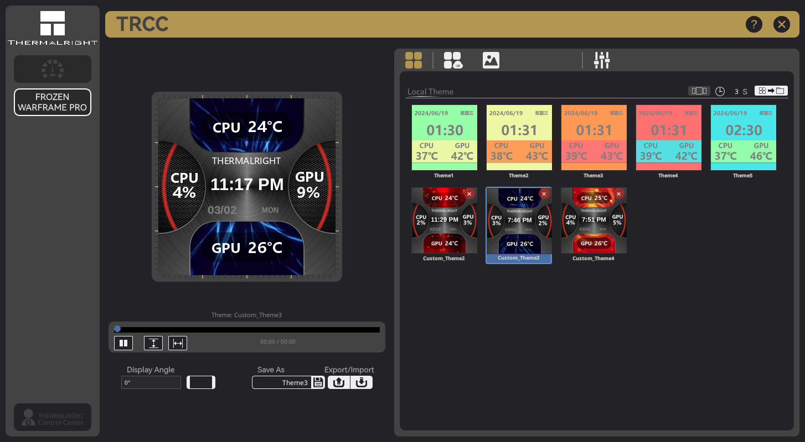

# Intro
> "I’ll do it while you talk" - Józef Piłsudski, was the founding father of modern Poland

> "Free software is a matter of liberty, not price. To understand the concept, you should think of free as in free speech, not as in free beer." - [Richard Stallman](https://stallman.org/), founder of the [Free Software Foundation](https://www.fsf.org/)
# TRCC Linux
> **Looking for testers!** We need **Linux**, **Windows**, **macOS**, and **BSD** testers. If you have a Thermalright LCD or LED device on any platform, grab the latest [release](https://github.com/Lexonight1/thermalright-trcc-linux/releases/latest) and [let us know how it goes](https://github.com/Lexonight1/thermalright-trcc-linux/issues) — run `trcc report` and paste the output in an issue. Every test report helps, even if nothing works yet!

> **Solo hobbyist project** — built in my spare time, one device, no corporate backing. Just a Linux user who got tired of waiting for Thermalright to support us. If something breaks, please be patient — I do this for free because I like helping people. If this project helps you, consider [buying me a beer](https://buymeacoffee.com/Lexonight1) 🍺 or [Ko-fi](https://ko-fi.com/lexonight1) ☕

> **Need help?** [Open a GitHub issue](https://github.com/Lexonight1/thermalright-trcc-linux/issues/new) — that's the only place I see support requests. I don't monitor Reddit, forums, Discord, or Discussions. Run `trcc report` and paste the output so I can actually help you.

[](https://github.com/Lexonight1/thermalright-trcc-linux/releases/latest)
[](https://pypi.org/project/trcc-linux/)
[](https://github.com/Lexonight1/thermalright-trcc-linux/releases)
[](https://pypi.org/project/trcc-linux/)
[](LICENSE)
[](https://github.com/Lexonight1/thermalright-trcc-linux)

[](https://github.com/Lexonight1/thermalright-trcc-linux/actions/workflows/ci.yml)
[](https://github.com/Lexonight1/thermalright-trcc-linux/actions/workflows/ci.yml)
[](https://github.com/Lexonight1/thermalright-trcc-linux/actions/workflows/ci.yml)
[](https://python.org)
[](https://docs.astral.sh/ruff/)
[](https://microsoft.github.io/pyright/)

[](https://github.com/Lexonight1/thermalright-trcc-linux/stargazers)
[](https://github.com/Lexonight1/thermalright-trcc-linux/network/members)
[](https://github.com/Lexonight1/thermalright-trcc-linux/issues)
[](https://github.com/Lexonight1/thermalright-trcc-linux/commits/main)
[](https://github.com/Lexonight1/thermalright-trcc-linux)

**Packages:**

[](https://github.com/Lexonight1/thermalright-trcc-linux/releases/latest)
[](https://github.com/Lexonight1/thermalright-trcc-linux/releases/latest)

[](https://github.com/Lexonight1/thermalright-trcc-linux/releases/latest)
[](https://github.com/Lexonight1/thermalright-trcc-linux/releases/latest)

[](https://github.com/Lexonight1/thermalright-trcc-linux/releases/latest)
[](https://github.com/Lexonight1/thermalright-trcc-linux/releases/latest)
[](https://github.com/Lexonight1/thermalright-trcc-linux/releases/latest)

[](https://github.com/Lexonight1/thermalright-trcc-linux/blob/main/flake.nix)
[](https://github.com/Lexonight1/thermalright-trcc-linux/tree/main/packaging/gentoo)

[](https://buymeacoffee.com/Lexonight1)
[](https://ko-fi.com/lexonight1)

> 💛 **Monthly backer: [@Reborn627](https://github.com/Reborn627)** — four straight months of recurring support. Steady backing like that is what actually keeps a one-person project alive. Thank you.

> Huge thanks to **[@Xentrino](https://github.com/Xentrino)**, **[@javisaman](https://github.com/javisaman)**, **[@loosethoughts19-hash](https://github.com/loosethoughts19-hash)**, **[@Mr-Renegade](https://github.com/Mr-Renegade)**, **[@knappstar](https://github.com/knappstar)**, **[@woebygon](https://github.com/woebygon)**, **[@Smokemic](https://github.com/Smokemic)**, **[@chava-byte](https://github.com/chava-byte)**, **[@nihilistqueen](https://github.com/nihilistqueen)**, **[@rhuggins573-crypto](https://github.com/rhuggins573-crypto)**, **[@unfirthman](https://github.com/unfirthman)**, **[@Milrite](https://github.com/Milrite)**, **[@BAS-HARBERS](https://github.com/BAS-HARBERS)**, **Glyn**, **dugalex**, **Dunvcpi**, **RichardK**, **Ryan**, **Rick**, and an anonymous supporter for the beers — you're all legends. 🍺

Native Linux port of the Thermalright LCD Control Center (Windows TRCC 2.1.2). Control and customize the LCD displays and LED segment displays on Thermalright CPU coolers, AIO pump heads, and fan hubs — entirely from Linux.

> **This project wouldn't exist without our testers.** I only own one device. Every supported device in this list works because someone plugged it in, ran `trcc report`, and told me what broke. 32 testers helped us go from "SCSI only" to full C# feature parity with 6 USB protocols, 16 FBL resolutions, and 13 LED styles. Open source at its best — see [Contributors](#contributors) below.

> Unofficial community project, not affiliated with Thermalright. Built with [Claude](https://claude.ai) (AI) for protocol reverse engineering and code generation, guided by human architecture decisions and logical assessment.

## Install

### Native packages (recommended)

Pre-built packages are available for every major distro. No pip, no venv, no PEP 668 headaches — just download and install like any other app. Every release is built automatically from source using [GitHub Actions](https://github.com/Lexonight1/thermalright-trcc-linux/actions/workflows/release.yml) — the build logs are public so anyone can verify what went in.

> For detailed step-by-step instructions, troubleshooting, and alternative install methods, see the **[Install Guide](doc/GUIDE_INSTALL.md)**.

| Distro | Install Guide |
|--------|--------------|
| Fedora / Nobara / openSUSE | [Fedora](doc/GUIDE_INSTALL.md#fedora--nobara) |
| Bazzite / Bluefin / Aurora / Universal Blue | [Immutable Fedora](doc/GUIDE_INSTALL.md#bazzite--aurora--bluefin--fedora-atomic) |
| Ubuntu 24.04+ / Debian 13+ / Mint 22+ / Pop!_OS / Zorin | [Ubuntu / Debian](doc/GUIDE_INSTALL.md#ubuntu--debian--mint--pop_os--zorin) |
| Ubuntu 22.04 / Mint 21.x / Debian 12 (older) | [Legacy DEB](doc/GUIDE_INSTALL.md#ubuntu-2204--mint-21x--debian-12-legacy-deb) |
| Arch / CachyOS / Manjaro / EndeavourOS / Garuda | [Arch](doc/GUIDE_INSTALL.md#arch--cachyos--manjaro--endeavouros--garuda) |
| NixOS | [NixOS](doc/GUIDE_INSTALL.md#nixos) |
| Gentoo | [Gentoo](doc/GUIDE_INSTALL.md#gentoo) |
| SteamOS (Steam Deck) | [SteamOS](doc/GUIDE_INSTALL.md#steamos-steam-deck) |
| Windows 10/11 | [Windows](doc/GUIDE_INSTALL.md#windows-experimental) |
| macOS 11+ | [macOS](doc/GUIDE_INSTALL.md#macos-experimental) |
| FreeBSD | [FreeBSD](doc/GUIDE_INSTALL.md#freebsd-experimental) |

Each guide has a one-liner copy-paste command and step-by-step instructions. After installing, unplug and replug the USB cable, then run `trcc gui`.

### Verify your download

Every release includes a `SHA256SUMS.txt` file. Download it from the same release page, then:

```bash
cd ~/Downloads
sha256sum -c SHA256SUMS.txt --ignore-missing
```

If you see `OK` next to your package — it's clean. Source code is GPL-3.0, fully auditable — no binaries, no obfuscation, no telemetry.

### PyPI

Best option for very old distros (Ubuntu 20.04, Debian 11) or if you prefer Python packaging. For Ubuntu 22.04 / Mint 21.x / Debian 12, the [Legacy DEB](doc/GUIDE_INSTALL.md#ubuntu-2204--mint-21x--debian-12-legacy-deb) is easier.

```bash
# Install system dependencies first
sudo apt install pipx libusb-1.0-0 sg3-utils p7zip-full libxcb-cursor0  # Debian/Ubuntu/Mint
sudo dnf install pipx libusb-1.0.0 sg3_utils p7zip                      # Fedora

# Install trcc-linux
pipx install trcc-linux
trcc system setup        # interactive wizard — udev rules, desktop entry
```

Then **unplug and replug the USB cable** and run `trcc gui`.

> `pipx` not installed? `sudo apt install pipx` (Debian/Ubuntu), `sudo dnf install pipx` (Fedora), `sudo pacman -S python-pipx` (Arch). See the **[Install Guide](doc/GUIDE_INSTALL.md)** for your distro.

> **NVIDIA GPU metrics?** The app detects your card and offers to install the sensor reader on first launch (it installs into your environment automatically). To add it upfront instead: `pipx install "trcc-linux[nvidia]"`.

### Automatic (git clone)

```bash
git clone https://github.com/Lexonight1/thermalright-trcc-linux.git
cd thermalright-trcc-linux
sudo ./install.sh
```

Detects your distro, installs system packages, Python deps, udev rules, and desktop shortcut.

### Supported distros

Fedora, Nobara, Ubuntu, Debian, Mint, Pop!_OS, Zorin, elementary OS, Arch, Manjaro, EndeavourOS, CachyOS, Garuda, openSUSE, Void, Gentoo, Alpine, NixOS, Bazzite, Aurora, Bluefin, SteamOS (Steam Deck).

> **`trcc: command not found`?** Open a new terminal — pip installs to `~/.local/bin` which needs a new shell session to appear on PATH.

> See the **[Install Guide](doc/GUIDE_INSTALL.md)** for distro-specific instructions and troubleshooting.

### Have an untested device?

Run `trcc report` and [paste the output in an issue](https://github.com/Lexonight1/thermalright-trcc-linux/issues/new) — takes 30 seconds. See the **[full list of devices that need testers](doc/TESTERS_WANTED.md)**.



## Usage

### GUI

```bash
trcc gui
```

Full desktop app with theme browser, video player, overlay editor, LED control panel, and hardware sensor dashboard.

### CLI

Device commands take your device **key** (its `VID:PID`, from `trcc detect`) as the first argument — e.g. `0402:3922`:

```bash
trcc detect                                     # Show connected devices + their keys
trcc display send-image 0402:3922 image.png     # Send an image to the LCD
trcc display color 0402:3922 "#ff0000"          # Fill the LCD with a solid color
trcc display load-video 0402:3922 clip.mp4      # Play a video on the LCD
trcc display screencast 0402:3922               # Live screen capture to the LCD
trcc display set-brightness 0402:3922 80        # Brightness (0–100%)
trcc display set-orientation 0402:3922 90       # Rotate display (0/90/180/270)
trcc led color 0416:8001 "#00ff00"              # Set LED color
trcc led mode 0416:8001 breathing               # Set LED effect mode
trcc report                                     # Generate diagnostic report
trcc doctor                                     # Check system dependencies
trcc system setup                               # Interactive setup wizard
```

> **Command groups:** LCD actions live under `trcc display …`, LED under `trcc led …`, themes under `trcc theme …`; diagnostics (`report`, `detect`, `doctor`, `sensors`) are top-level; OS setup under `trcc system …`. Run `trcc --help` or `trcc display --help` to explore, and see the **[CLI Guide](doc/GUIDE_CLI.md)** for the full walkthrough.

See the **[CLI Reference](doc/REFERENCE_CLI.md)** for the full command list.

### REST API

Start the API server and control your devices remotely:

```bash
trcc serve                    # Start on http://localhost:9876
trcc serve --port 8080        # Custom port
trcc serve --tls              # HTTPS with auto-generated self-signed cert
trcc serve --host 0.0.0.0     # Listen on all interfaces (LAN access)
```

78 endpoints covering devices, display, LED, themes, and system metrics. Use `trcc api` to list all endpoints.

```bash
# Examples with curl
curl http://localhost:9876/devices              # List devices
curl -X POST http://localhost:9876/display/send \
  -F "file=@wallpaper.png"                     # Send image
curl -X POST http://localhost:9876/led/color \
  -H "Content-Type: application/json" \
  -d '{"color": "#ff0000"}'                    # Set LED color
```

### Tips

**Mounting your device vertically?**
Set the angle to **90°** (or 270°) in the GUI, then open **Cloud Themes** — the browser will automatically show portrait-orientation themes for your device's rotated dimensions. Download and apply one of those for a proper vertical layout. Local themes are landscape-only; portrait layouts come from the cloud theme packs.

## Documentation

| Document | Description |
|----------|-------------|
| [Install Guide](doc/GUIDE_INSTALL.md) | Installation for all major distros |
| [CLI Reference](doc/REFERENCE_CLI.md) | All CLI commands with options and examples |
| [User Guide](doc/GUIDE_USER.md) | How to use everything — GUI, themes, overlays, media, LED |
| [API Reference](doc/REFERENCE_API.md) | All 78 REST API endpoints with request/response models |
| [Troubleshooting](doc/GUIDE_TROUBLESHOOTING.md) | Common issues and fixes |
| [New to Linux](doc/GUIDE_NEW_TO_LINUX.md) | Guide for Linux beginners |
| [Changelog](doc/CHANGELOG.md) | Version history |
| [Supported Devices](doc/REFERENCE_DEVICES.md) | Full device list with USB IDs and protocols |
| [Testers Wanted](doc/TESTERS_WANTED.md) | Devices that need hardware validation |
| [Device Testing Guide](doc/GUIDE_DEVICE_TESTING.md) | How to test and report device compatibility |
| [Architecture Guide](doc/GUIDE_ARCHITECTURE.md) | Project layout, hexagonal design, and the unified UI presentation layer |
| [Technical Reference](doc/REFERENCE_TECHNICAL.md) | SCSI protocol and file formats |

### Protocol documentation (reverse-engineered from Windows TRCC)

| Document | Description |
|----------|-------------|
| [Technical Reference](doc/REFERENCE_TECHNICAL.md) | SCSI protocol, FBL detection, PM/SUB mapping |
| [USBLCDNEW Protocol](doc/PROTOCOL_USBLCDNEW.md) | USB bulk/LY frame transfer protocol |
| [USBLED Protocol](doc/PROTOCOL_USBLED.md) | HID LED segment display protocol |

## Features

| Category | What you get |
|----------|-------------|
| **GUI** | Full PySide6 desktop app — theme browser, video player, overlay editor, LED control panel, 38 languages |
| **CLI** | `trcc gui`, `trcc send`, `trcc video`, `trcc led-color`, `trcc screencast`, `trcc shell`, and more |
| **REST API** | 78 endpoints — control everything remotely, build integrations, automate your setup |
| **Themes** | Local, cloud, and masks — carousel mode, export/import as `.tr` files, custom mask upload with X/Y positioning, 5 starters + 120 masks per resolution |
| **Media** | Video/GIF playback on LCD, video trimmer, image cropper, screen cast (X11 + Wayland), mic audio visualization |
| **Overlay Editor** | Text, sensors, date/time overlays — font picker, dynamic scaling, color picker |
| **Hardware Sensors** | 77+ sensors — CPU/GPU temp, fan speed, power, usage — customizable dashboard |
| **LED Control** | 13 LED styles, zone carousel, breathing/rainbow/static/wave modes, per-zone color |
| **Display** | 16 resolutions (240x240 to 1920x462), 0/90/180/270 rotation, 3 brightness levels |
| **Multi-device** | Per-device config, auto-detect, multi-device with device selection |
| **Security** | udev rules, polkit policy, SELinux support, no root required after setup |

**Under the hood**: 223 source files, ~71K lines of Python, 1783 tests across 104 test files. Hexagonal architecture with strict dependency injection — GUI, CLI, and API all talk to the same core services. 6 USB protocols reverse-engineered from the Windows C# app.

### What we do better than Windows TRCC

- **38 languages** — Windows has 10 (baked into PNGs). We render text at runtime, community can add more
- **CLI + REST API** — Windows is GUI-only. We have full CLI and 49 API endpoints for automation
- **Custom mask upload** — upload your own PNG overlay, position with X/Y controls, saved to `~/.trcc-user/`
- **No admin required** — udev rules handle permissions. Windows needs "Run as Administrator"
- **Open source** — read the code, fix bugs, add features. Windows TRCC is closed-source .NET
- **Screencast on Wayland** — Windows can't do that either
- **Audio visualization** — mic spectrum analyzer on screencast. Windows doesn't have this
- **Hexagonal architecture** — GUI, CLI, and API share the same core. No feature lag between interfaces

### 38-Language GUI (i18n)

The Windows TRCC app ships 10 languages by baking translated text into separate PNG background images — 129 PNGs just for panel labels. We replaced all of that with a runtime i18n system: language-neutral background PNGs + QLabel text overlays rendered from `core/i18n.py`. Switching languages updates every label instantly — no restart, no extra files.

**Supported languages:** Simplified Chinese, Traditional Chinese, English, German, Russian, French, Portuguese, Japanese, Spanish, Korean, Italian, Dutch, Polish, Turkish, Arabic, Hindi, Thai, Vietnamese, Indonesian, Czech, Swedish, Danish, Norwegian, Finnish, Hungarian, Romanian, Ukrainian, Greek, Hebrew, Malay, Bengali, Urdu, Farsi, Tagalog, Tamil, Punjabi, Swahili, Burmese

Adding a new language is one dict entry per string in `core/i18n.py` — no PNG editing, no asset pipeline. Community translations welcome.

### Supported Devices

Run `lsusb` to find your USB ID (`xxxx:xxxx` after `ID`), then match it below.

**SCSI devices** — fully supported:
| USB ID | Devices |
|--------|---------|
| `87CD:70DB` | FROZEN HORIZON PRO, FROZEN MAGIC PRO, FROZEN VISION V2, CORE VISION, ELITE VISION, AK120, AX120, PA120 DIGITAL, Wonder Vision |
| `0416:5406` | LC1, LC2, LC3, LC5 (AIO pump heads) |
| `0402:3922` | FROZEN WARFRAME, FROZEN WARFRAME 360, FROZEN WARFRAME SE, ELITE VISION 360 |

**Bulk USB devices** — raw USB protocol:
| USB ID | Devices |
|--------|---------|
| `87AD:70DB` | GrandVision 360 AIO, Mjolnir Vision 360, Wonder Vision Pro 360, Frozen Warframe Pro |

**LY USB devices** — chunked bulk protocol:
| USB ID | Devices |
|--------|---------|
| `0416:5408` | Trofeo Vision 9.16 LCD |
| `0416:5409` | (LY1 variant) |

**HID LCD devices** — auto-detected:
| USB ID | Devices |
|--------|---------|
| `0416:5302` | Trofeo Vision LCD, Assassin Spirit 120 Vision ARGB, AS120 VISION, BA120 VISION, FROZEN WARFRAME, FROZEN WARFRAME 360, FROZEN WARFRAME SE, FROZEN WARFRAME PRO, ELITE VISION, LC5 |
| `0418:5303` | TARAN ARMS |
| `0418:5304` | TARAN ARMS |

**HID LED devices** — RGB LED control:
| USB ID | Devices |
|--------|---------|
| `0416:8001` | AX120 DIGITAL, PA120 DIGITAL, Peerless Assassin 120 DIGITAL ARGB White, Assassin X 120R Digital ARGB, Phantom Spirit 120 Digital EVO, HR10 2280 PRO Digital, Magic Qube, and others (model auto-detected via handshake) |

> See the [full device list with protocol details](doc/REFERENCE_DEVICES.md) and the [Device Testing Guide](doc/GUIDE_DEVICE_TESTING.md) if you have an untested device.

## Architecture

```text
src/trcc/
├── core/           # Models, enums, domain constants — zero I/O
├── services/       # Business logic — pure Python, no framework deps
├── adapters/       # USB device protocols (SCSI, HID, Bulk, LY, LED)
├── ui/
│   ├── gui/        # PySide6 GUI — themes, video, overlay, LED, sensors
│   ├── cli/        # Typer CLI — 95 commands across 8 modules
│   └── api/        # FastAPI REST API — 78 endpoints across 7 modules
├── _boot.py        # Composition root — returns Trcc or TrccProxy
├── daemon.py       # Optional singleton daemon mode (TRCC_DAEMON=1)
├── ipc.py          # Manifold IPC — UI ↔ daemon over Unix socket
├── conf.py         # Settings singleton
└── assets/         # GUI images, desktop entry, polkit policy, systemd service
```

**Hexagonal architecture** — GUI, CLI, and API are interchangeable adapters over the same core services. Adding a new interface (Android app, Home Assistant plugin) means writing a new adapter, not touching business logic.

### Reproducing reporter bugs (contributors)

When a `trcc report` lands on an issue, the harness in `dev/smoke_anything.py` runs every probe — handshake idempotency, video target dims, RAPL discovery, WMI CoInitialize, addr-threading, sleep/resume cycle — through the fully DI'd stack at the reporter's exact OS + device:

```bash
PYTHONPATH=src python3 dev/smoke_anything.py --from-report report.txt
PYTHONPATH=src python3 dev/smoke_anything.py --os linux --device 87ad:70db
PYTHONPATH=src python3 dev/smoke_anything.py --list-probes
```

If a probe goes `BAD`, that's the bug — fix in `src/`, re-run, see `PASS`. Every reproduced regression becomes a new probe in `PROBES`, so the next reporter with the same root cause gets caught in 30 seconds. Discipline: never reply "try vX.Y.Z" until a probe has actually gone `PASS` against the reporter's environment.

**6 USB protocols** reverse-engineered from the Windows C# app:

| Protocol | Transport | Devices |
|----------|-----------|---------|
| SCSI | SG_IO ioctl | Frozen Warframe, Elite Vision, AK/AX120, PA120, LC1-5 |
| HID Type 2 | pyusb interrupt | Trofeo Vision, Assassin Spirit, AS/BA120, Frozen Warframe SE/PRO |
| HID Type 3 | pyusb interrupt | TARAN ARMS |
| Bulk | pyusb bulk | GrandVision 360, Mjolnir Vision 360, Wonder Vision Pro 360, Frozen Warframe Pro |
| LY | pyusb bulk (chunked) | Trofeo Vision 9.16 LCD |
| LED | pyusb HID | All LED segment display devices (13 styles) |

## Code Contributors

These folks didn't just report a problem — they opened the editor and sent a fix. On a solo project, a merged pull request is about the most generous thing you can do, and every one of these shipped to every user:

- **[@jphilipb](https://github.com/jphilipb)** — [#215](https://github.com/Lexonight1/thermalright-trcc-linux/pull/215): reverse-engineered and hardware-validated the Thermalright Magic Qube (65-LED segment display) — a device that doesn't even exist in the Windows app — and wired up full support from scratch.
- **[@Hythera](https://github.com/Hythera)** — [#209](https://github.com/Lexonight1/thermalright-trcc-linux/pull/209): had the flake read its version straight from `pyproject.toml`, killing an entire place I used to have to bump by hand every release.
- **[@elsiedotcafe](https://github.com/elsiedotcafe)** — [#123](https://github.com/Lexonight1/thermalright-trcc-linux/pull/123): pinned the PySide6 package to a stable source so the build stops breaking.

Thank you all — genuinely. PRs are always welcome, and you'll land right here.

## Contributors

A huge thank you to every single person who filed an issue, pasted a `trcc report`, or just said "it doesn't work." You are the reason this project supports 6 USB protocols, 16 resolutions, and 13 LED styles from a single developer with one device. Every bug report, every test on hardware I don't own, every "hey this is broken" — that's open source at its best. You're not wasting your time. You're building something together.

Special thanks to everyone who has contributed invaluable reports to this project:

**Frozen Warframe** — **[gizbo](https://github.com/gizbo)** · **[knappstar](https://github.com/knappstar)** · **[Scifiguygaming](https://github.com/Scifiguygaming)** · **[apj202-ops](https://github.com/apj202-ops)** · **[loosethoughts19-hash](https://github.com/loosethoughts19-hash)** · **[Edoardo-Rossi-EOS](https://github.com/Edoardo-Rossi-EOS)** · **[edoargo1996](https://github.com/edoargo1996)** · **[stephendesmond1-cmd](https://github.com/stephendesmond1-cmd)** · **[riodevelop](https://github.com/riodevelop)** · **[wobbegongus](https://github.com/wobbegongus)** · **[Pallemz](https://github.com/Pallemz)** · **[pawbtism](https://github.com/pawbtism)**

**Trofeo Vision** — **[N8ghtz](https://github.com/N8ghtz)** · **[PantherX12max](https://github.com/PantherX12max)** · **[ravensvoice](https://github.com/ravensvoice)** · **[beret21](https://github.com/beret21)** · **[jimmister1234-bit](https://github.com/jimmister1234-bit)** · **[Tavus1990](https://github.com/Tavus1990)** · **[ImlostinIKEA](https://github.com/ImlostinIKEA)** · **[ronny79privat](https://github.com/ronny79privat)** · **[OptimalKiller](https://github.com/OptimalKiller)**

**GrandVision 360 AIO** — **[bipobuilt](https://github.com/bipobuilt)** · **[cadeon](https://github.com/cadeon)** · **[Reborn627](https://github.com/Reborn627)** · **[TheManchineel](https://github.com/TheManchineel)** · **[ImlostinIKEA](https://github.com/ImlostinIKEA)**

**Assassin Spirit 120 Vision** — **[michael-spinelli](https://github.com/michael-spinelli)** · **[acioannina-wq](https://github.com/acioannina-wq)**

**Assassin X 120R Digital ARGB** — **[hexskrew](https://github.com/hexskrew)** · **[rhuggins573-crypto](https://github.com/rhuggins573-crypto)**

**Peerless Assassin 120 Digital ARGB** — **[Xentrino](https://github.com/Xentrino)** · **[Vydon](https://github.com/Vydon)**

**PA120 Digital** — **[Pewful2021](https://github.com/Pewful2021)** · **[lallemandgianni-boop](https://github.com/lallemandgianni-boop)** · **[mody446](https://github.com/mody446)**

**Phantom Spirit 120 Digital EVO** — **[javisaman](https://github.com/javisaman)** · **[Rizzzolo](https://github.com/Rizzzolo)** · **[chava-byte](https://github.com/chava-byte)**

**Wonder Vision** — **[Civilgrain](https://github.com/Civilgrain)** · **[Alb3e3](https://github.com/Alb3e3)**

**AX120 Digital** — **[shadowepaxeor-glitch](https://github.com/shadowepaxeor-glitch)**

**Elite Vision 360** — **[tensaiteki](https://github.com/tensaiteki)**

**Mjolnir Vision 360** — **[Pikarz](https://github.com/Pikarz)** · **[RonyPony1234](https://github.com/RonyPony1234)**

**Peerless Assassin 140 Digital** — **[MioHorizon](https://github.com/MioHorizon)**

**Peerless Vision** — **[Mr-Renegade](https://github.com/Mr-Renegade)**

**Stream Vision** — **[Me-shok](https://github.com/Me-shok)**

**HR10 2280 PRO Digital** — **[Lcstyle](https://github.com/Lcstyle)**

**macOS** — **[jaminmc](https://github.com/jaminmc)** (Apple Silicon sensor research, PR #114 feedback)

**General** — **[wrightbyname](https://github.com/wrightbyname)** · **[mog199](https://github.com/mog199)** · **[jezzaw007](https://github.com/jezzaw007)** · **[sleeper14200](https://github.com/sleeper14200)** · **[kabi02](https://github.com/kabi02)** · **[david43](https://github.com/david43)** · **[Deltawolf](https://github.com/Deltawolf)** · **[JoshWrites](https://github.com/JoshWrites)** · **[jun3010me](https://github.com/jun3010me)** · **[Litsas](https://github.com/Litsas)** · **[MoltenMonster](https://github.com/MoltenMonster)** · **[ProfessorJoed](https://github.com/ProfessorJoed)** · **[qwerty22121998](https://github.com/qwerty22121998)** · **[unfirthman](https://github.com/unfirthman)** · **[ux370](https://github.com/ux370)** · **[vlad1](https://github.com/vlad1)** · **GlynL**

## Bug Reporters

Every name here took the time to open an issue and say "hey, this isn't working like I'd want it to." That isn't a complaint — it's a gift. Each one of these reports, on hardware I mostly don't own, is what made TRCC better for everyone who came after.

**[aaron-siegel](https://github.com/aaron-siegel)** · **[acioannina-wq](https://github.com/acioannina-wq)** · **[Alb3e3](https://github.com/Alb3e3)** · **[AnalogKnight](https://github.com/AnalogKnight)** · **[apj202-ops](https://github.com/apj202-ops)** · **[Archivist-lnx](https://github.com/Archivist-lnx)** · **[AussieMakerGeek](https://github.com/AussieMakerGeek)** · **[Axellarator](https://github.com/Axellarator)** · **[bariscetinbc](https://github.com/bariscetinbc)** · **[BAS-HARBERS](https://github.com/BAS-HARBERS)** · **[behold81](https://github.com/behold81)** · **[beret21](https://github.com/beret21)** · **[bipobuilt](https://github.com/bipobuilt)** · **[bktdrinal](https://github.com/bktdrinal)** · **[bookhaja-sys](https://github.com/bookhaja-sys)** · **[charlesbuihoanthien](https://github.com/charlesbuihoanthien)** · **[chava-byte](https://github.com/chava-byte)** · **[Civilgrain](https://github.com/Civilgrain)** · **[cs1171](https://github.com/cs1171)** · **[darrenwalter03-create](https://github.com/darrenwalter03-create)** · **[david43](https://github.com/david43)** · **[Deltawolf](https://github.com/Deltawolf)** · **[developer-yl](https://github.com/developer-yl)** · **[Dezuvo](https://github.com/Dezuvo)** · **[dking072](https://github.com/dking072)** · **[DomingosDSA](https://github.com/DomingosDSA)** · **[Duncpi](https://github.com/Duncpi)** · **[Edoardo-Rossi-EOS](https://github.com/Edoardo-Rossi-EOS)** · **[edoargo1996](https://github.com/edoargo1996)** · **[em73es](https://github.com/em73es)** · **[evultrole](https://github.com/evultrole)** · **[FLScales](https://github.com/FLScales)** · **[gadgetsboi](https://github.com/gadgetsboi)** · **[gizbo](https://github.com/gizbo)** · **[hexskrew](https://github.com/hexskrew)** · **[Iam-Default](https://github.com/Iam-Default)** · **[iansu1075](https://github.com/iansu1075)** · **[ImlostinIKEA](https://github.com/ImlostinIKEA)** · **[jaminmc](https://github.com/jaminmc)** · **[javisaman](https://github.com/javisaman)** · **[jezzaw007](https://github.com/jezzaw007)** · **[jimmister1234-bit](https://github.com/jimmister1234-bit)** · **[JoshWrites](https://github.com/JoshWrites)** · **[juanito54jm-ux](https://github.com/juanito54jm-ux)** · **[jun3010me](https://github.com/jun3010me)** · **[k1w3l](https://github.com/k1w3l)** · **[kabi02](https://github.com/kabi02)** · **[knappstar](https://github.com/knappstar)** · **[Krummeltjie](https://github.com/Krummeltjie)** · **[lallemandgianni-boop](https://github.com/lallemandgianni-boop)** · **[LapisBrib](https://github.com/LapisBrib)** · **[Lcstyle](https://github.com/Lcstyle)** · **[Litsas](https://github.com/Litsas)** · **[lMyst1caL](https://github.com/lMyst1caL)** · **[loosethoughts19-hash](https://github.com/loosethoughts19-hash)** · **[Maschnievsky](https://github.com/Maschnievsky)** · **[Me-shok](https://github.com/Me-shok)** · **[megatronk2](https://github.com/megatronk2)** · **[michael-spinelli](https://github.com/michael-spinelli)** · **[Milrite](https://github.com/Milrite)** · **[MioHorizon](https://github.com/MioHorizon)** · **[mlamport](https://github.com/mlamport)** · **[mody446](https://github.com/mody446)** · **[mog199](https://github.com/mog199)** · **[MoltenMonster](https://github.com/MoltenMonster)** · **[Mr-Renegade](https://github.com/Mr-Renegade)** · **[muccaretroattiva](https://github.com/muccaretroattiva)** · **[N8ghtz](https://github.com/N8ghtz)** · **[Necropsi](https://github.com/Necropsi)** · **[OmenDjinn](https://github.com/OmenDjinn)** · **[OptimalKiller](https://github.com/OptimalKiller)** · **[oranura](https://github.com/oranura)** · **[Pallemz](https://github.com/Pallemz)** · **[PantherX12max](https://github.com/PantherX12max)** · **[pawbtism](https://github.com/pawbtism)** · **[Pewful2021](https://github.com/Pewful2021)** · **[Pikarz](https://github.com/Pikarz)** · **[ProfessorJoed](https://github.com/ProfessorJoed)** · **[questist](https://github.com/questist)** · **[qwerty22121998](https://github.com/qwerty22121998)** · **[raragundi](https://github.com/raragundi)** · **[ravensvoice](https://github.com/ravensvoice)** · **[Reborn627](https://github.com/Reborn627)** · **[rhuggins573-crypto](https://github.com/rhuggins573-crypto)** · **[riodevelop](https://github.com/riodevelop)** · **[Rizzzolo](https://github.com/Rizzzolo)** · **[ronny79privat](https://github.com/ronny79privat)** · **[RonyPony1234](https://github.com/RonyPony1234)** · **[satoru8](https://github.com/satoru8)** · **[Scifiguygaming](https://github.com/Scifiguygaming)** · **[scottphanson-bit](https://github.com/scottphanson-bit)** · **[shadowepaxeor-glitch](https://github.com/shadowepaxeor-glitch)** · **[Sharibo](https://github.com/Sharibo)** · **[sleeper14200](https://github.com/sleeper14200)** · **[stephendesmond1-cmd](https://github.com/stephendesmond1-cmd)** · **[Sublyme-n-Vybe](https://github.com/Sublyme-n-Vybe)** · **[Tavus1990](https://github.com/Tavus1990)** · **[Tavus90](https://github.com/Tavus90)** · **[Tee86](https://github.com/Tee86)** · **[tensaiteki](https://github.com/tensaiteki)** · **[TheJMS-NQ](https://github.com/TheJMS-NQ)** · **[TheManchineel](https://github.com/TheManchineel)** · **[thousandwheels-coder](https://github.com/thousandwheels-coder)** · **[TimG-NL](https://github.com/TimG-NL)** · **[Tluxxa](https://github.com/Tluxxa)** · **[Tortillas-IT](https://github.com/Tortillas-IT)** · **[totub71](https://github.com/totub71)** · **[TowerIRL](https://github.com/TowerIRL)** · **[TuxLux40](https://github.com/TuxLux40)** · **[unfirthman](https://github.com/unfirthman)** · **[ux370](https://github.com/ux370)** · **[vlad1](https://github.com/vlad1)** · **[Vydon](https://github.com/Vydon)** · **[WillVinzant](https://github.com/WillVinzant)** · **[wobbegongus](https://github.com/wobbegongus)** · **[wrightbyname](https://github.com/wrightbyname)** · **[Xentrino](https://github.com/Xentrino)** · **[Zombie-hive](https://github.com/Zombie-hive)** · **[zypherz0920](https://github.com/zypherz0920)**

## Stars

Every single star is a small vote of confidence that this is worth keeping alive — and on the days the bugs are winning, watching that count tick up genuinely keeps me going. It costs you one click and it means more than you'd think. Thank you to all 120+ of you:

**[akasvi](https://github.com/akasvi)** · **[alessa-lara](https://github.com/alessa-lara)** · **[alicepolice](https://github.com/alicepolice)** · **[ArcaneCoder404](https://github.com/ArcaneCoder404)** · **[Arty-x-g](https://github.com/Arty-x-g)** · **[audacieuxnumber1](https://github.com/audacieuxnumber1)** · **[azrael1911](https://github.com/azrael1911)** · **[bbrriiaann97](https://github.com/bbrriiaann97)** · **[behold81](https://github.com/behold81)** · **[betolink](https://github.com/betolink)** · **[bfesfbsbfesfbn](https://github.com/bfesfbsbfesfbn)** · **[bive242](https://github.com/bive242)** · **[brook-cheng](https://github.com/brook-cheng)** · **[BrunoLeguizamon05](https://github.com/BrunoLeguizamon05)** · **[cancos1](https://github.com/cancos1)** · **[capiazmi](https://github.com/capiazmi)** · **[cdh407](https://github.com/cdh407)** · **[cesarnr21](https://github.com/cesarnr21)** · **[chirox](https://github.com/chirox)** · **[codeflitting](https://github.com/codeflitting)** · **[CT-Actual](https://github.com/CT-Actual)** · **[curttheg](https://github.com/curttheg)** · **[dabombUSA](https://github.com/dabombUSA)** · **[damachine](https://github.com/damachine)** · **[DasFlogetier](https://github.com/DasFlogetier)** · **[david43](https://github.com/david43)** · **[DavidKirkitadze](https://github.com/DavidKirkitadze)** · **[Dezinger](https://github.com/Dezinger)** · **[Dezuvo](https://github.com/Dezuvo)** · **[eap5](https://github.com/eap5)** · **[eduu-dudu](https://github.com/eduu-dudu)** · **[emaspa](https://github.com/emaspa)** · **[enricomarchesin](https://github.com/enricomarchesin)** · **[falumamx](https://github.com/falumamx)** · **[Gdetrane](https://github.com/Gdetrane)** · **[greaseyjockey](https://github.com/greaseyjockey)** · **[guowc](https://github.com/guowc)** · **[gupsterg](https://github.com/gupsterg)** · **[huzky-v](https://github.com/huzky-v)** · **[hydrogen2005](https://github.com/hydrogen2005)** · **[immenz](https://github.com/immenz)** · **[israelsz](https://github.com/israelsz)** · **[jamespo](https://github.com/jamespo)** · **[jaminmc](https://github.com/jaminmc)** · **[jezzaw007](https://github.com/jezzaw007)** · **[jhlasnik](https://github.com/jhlasnik)** · **[jmo808](https://github.com/jmo808)** · **[Jorann](https://github.com/Jorann)** · **[JuanVargas](https://github.com/JuanVargas)** · **[JyeroRayguster404](https://github.com/JyeroRayguster404)** · **[k1w3l](https://github.com/k1w3l)** · **[KawalChlopa](https://github.com/KawalChlopa)** · **[kazhala](https://github.com/kazhala)** · **[knappstar](https://github.com/knappstar)** · **[kyle-tracy](https://github.com/kyle-tracy)** · **[Langustensorbet](https://github.com/Langustensorbet)** · **[Legendarycentaur](https://github.com/Legendarycentaur)** · **[Leonnaki](https://github.com/Leonnaki)** · **[Lfatua](https://github.com/Lfatua)** · **[llauer](https://github.com/llauer)** · **[lotte25](https://github.com/lotte25)** · **[m-marcal](https://github.com/m-marcal)** · **[mgaruccio](https://github.com/mgaruccio)** · **[michelle0812](https://github.com/michelle0812)** · **[mkogut](https://github.com/mkogut)** · **[monkky](https://github.com/monkky)** · **[mrsaraiva](https://github.com/mrsaraiva)** · **[N1sona](https://github.com/N1sona)** · **[narfel](https://github.com/narfel)** · **[nathanielhernandez](https://github.com/nathanielhernandez)** · **[nedimlisica](https://github.com/nedimlisica)** · **[nookpp](https://github.com/nookpp)** · **[NostraTiepus](https://github.com/NostraTiepus)** · **[NuiQuant](https://github.com/NuiQuant)** · **[oddajpierscien](https://github.com/oddajpierscien)** · **[okrzanowska](https://github.com/okrzanowska)** · **[PantherX12max](https://github.com/PantherX12max)** · **[Pewful2021](https://github.com/Pewful2021)** · **[Pikarz](https://github.com/Pikarz)** · **[psyrie](https://github.com/psyrie)** · **[qussaif10](https://github.com/qussaif10)** · **[qwerty22121998](https://github.com/qwerty22121998)** · **[Reborn627](https://github.com/Reborn627)** · **[Rehaell](https://github.com/Rehaell)** · **[reinierjh](https://github.com/reinierjh)** · **[rhuggins573-crypto](https://github.com/rhuggins573-crypto)** · **[riodevelop](https://github.com/riodevelop)** · **[RolandTaverner](https://github.com/RolandTaverner)** · **[rslater](https://github.com/rslater)** · **[satoru8](https://github.com/satoru8)** · **[saucymcbeef](https://github.com/saucymcbeef)** · **[shadowepaxeor-glitch](https://github.com/shadowepaxeor-glitch)** · **[ShaunnyBwoy](https://github.com/ShaunnyBwoy)** · **[sigizito](https://github.com/sigizito)** · **[Smokemic](https://github.com/Smokemic)** · **[Spebelgenenst](https://github.com/Spebelgenenst)** · **[spiritofjon](https://github.com/spiritofjon)** · **[stephenvalente](https://github.com/stephenvalente)** · **[sudo-st8less](https://github.com/sudo-st8less)** · **[SunnyZorya23](https://github.com/SunnyZorya23)** · **[the-black-eagle](https://github.com/the-black-eagle)** · **[Thymur](https://github.com/Thymur)** · **[TimG-NL](https://github.com/TimG-NL)** · **[Torotin](https://github.com/Torotin)** · **[trizmark](https://github.com/trizmark)** · **[TuxLux40](https://github.com/TuxLux40)** · **[urbnywrt](https://github.com/urbnywrt)** · **[vindocel](https://github.com/vindocel)** · **[Viwyn](https://github.com/Viwyn)** · **[Vydon](https://github.com/Vydon)** · **[wernerzsolt](https://github.com/wernerzsolt)** · **[Xentrino](https://github.com/Xentrino)** · **[YahusRevus](https://github.com/YahusRevus)** · **[zhanghangt](https://github.com/zhanghangt)** · **[Ziusz](https://github.com/Ziusz)**

## Forkers

Thanks for carrying the torch — these folks forked the repo to build on it.

**[capiazmi](https://github.com/capiazmi)** · **[dabombUSA](https://github.com/dabombUSA)** · **[danleyb2](https://github.com/danleyb2)** · **[DasFlogetier](https://github.com/DasFlogetier)** · **[elsiedotcafe](https://github.com/elsiedotcafe)** · **[jaminmc](https://github.com/jaminmc)** · **[jemte](https://github.com/jemte)** · **[jezzaw007](https://github.com/jezzaw007)** · **[JoshWrites](https://github.com/JoshWrites)** · **[jwcrowley](https://github.com/jwcrowley)** · **[maniwaroka](https://github.com/maniwaroka)** · **[taillis](https://github.com/taillis)** · **[TuxLux40](https://github.com/TuxLux40)**

## Donations

If this project saved you from keeping a Windows partition around, consider **[buying me a cold one](https://buymeacoffee.com/Lexonight1)**.

## License

[GPL-3.0](https://www.gnu.org/licenses/gpl-3.0.en.html) — free as in freedom. This project is and always will be free software. You can use it, study it, modify it, and share it. That's the deal.

Built on the shoulders of [Richard Stallman](https://stallman.org/), the [GNU Project](https://www.gnu.org/gnu/thegnuproject.en.html), and the [Free Software Foundation](https://www.fsf.org/). If you care about software freedom, [read why it matters](https://www.gnu.org/philosophy/free-sw.en.html).
